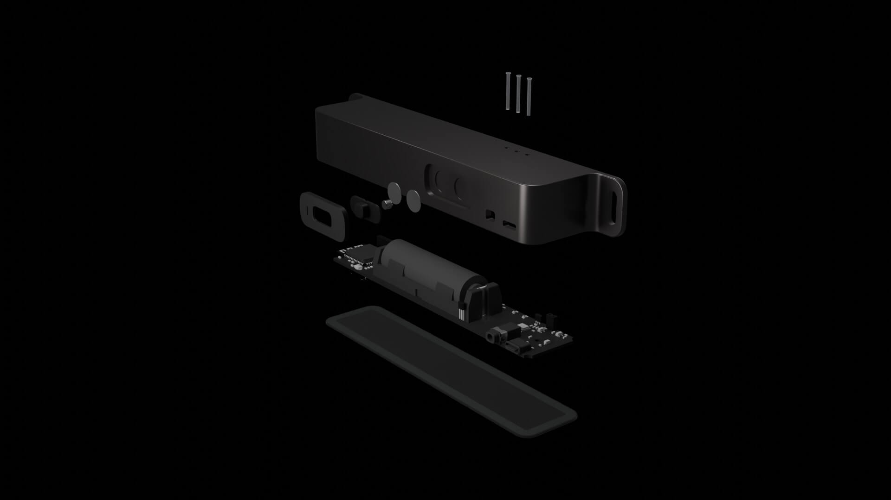
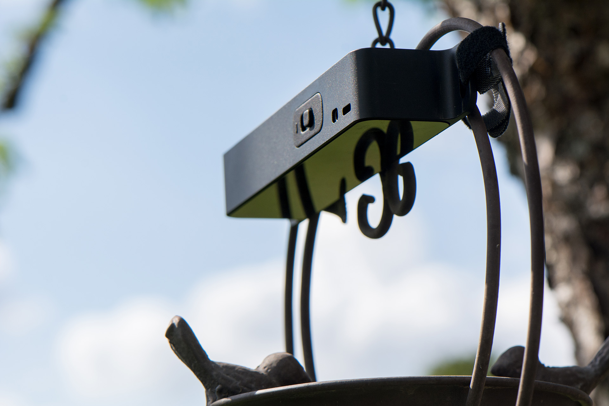
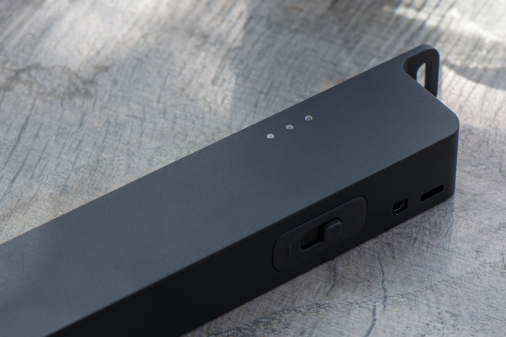
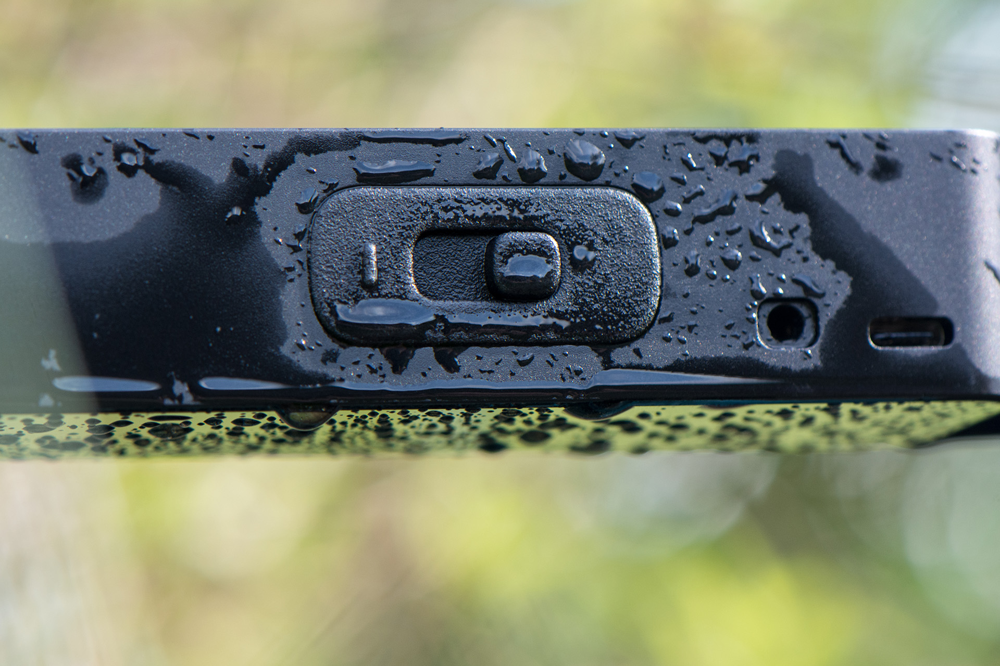

# Openthing 2 - RepTrap 

The RepTrap is a "motion detector" and camera trigger designed to detect small and/or cold-blooded animals such as frogs, lizards, birds, and other wildlife. It doesn't detect motion directly but instead identifies changes in height within the range of its four Time-of-Flight (ToF) sensors. Any height change within this range triggers a connected camera's shutter.

## BLE 

The device and software is Bluetooth ready but it is currently missing an App. Here are commands which can be send to configure and change the device:

- Bluetooth Service [`0xC532`]
    - **Status** Characteristic [`0xC541`]
      **Description**: Refelcts the current device status as a string
      **Values**: `running` `calibrating`
    - **Command** Characteristic [`0xC540`]
      **Description**: Accepts specific device commands
      **Values:**
      - `stop`: Stops the BLE Service on the device
      - `calibrate`: Triggers a re-calibration of the device
      - `xtalk`: Triggers an cross-talk and offset calibration of the device (only needed for manufacturing, should not be used)
      - `trigger`: Triggers the camera shutter and focus signal

