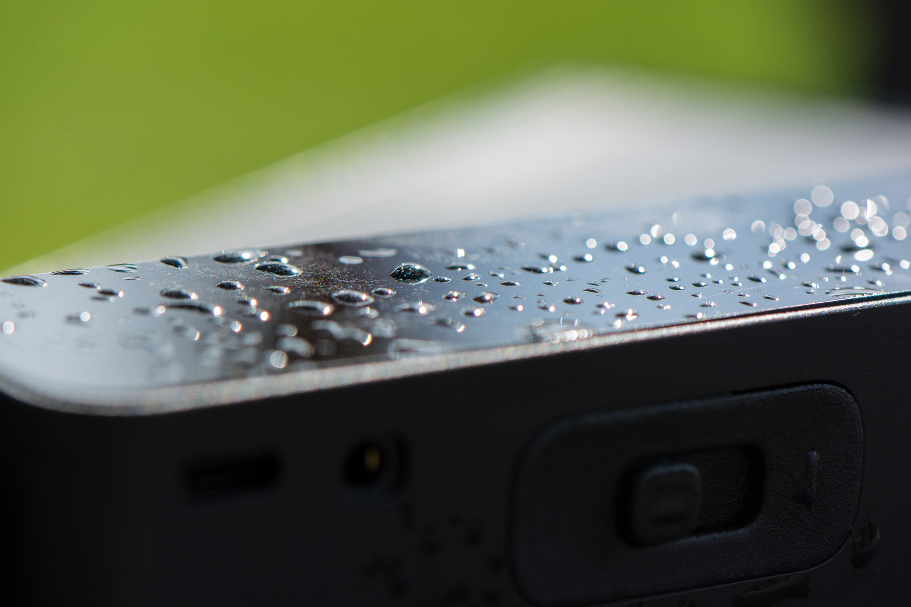

# Openthing 2 - RepTrap 

The RepTrap is a "motion detector" and camera trigger designed to detect small and/or cold-blooded animals such as frogs, lizards, birds, and other wildlife. It doesn't detect motion directly but instead identifies changes in height within the range of its four Time-of-Flight (ToF) sensors. Any height change within this range triggers a connected camera's shutter.

## BLE 

The device and software is Bluetooth ready but it is currently missing an App. Here are commands which can be send to configure and change the device:

- Bluetooth Service [`0x7017`]
    - **Status** Characteristic [`0x701C`]
      **Description**: Refelcts the current device status as a string
      **Values**: `running` `calibrating`
    - **Command** Characteristic [`0x7018`]
      **Description**: Accepts specific device commands
      **Values:**
      - `stop`: Stops the BLE Service on the device
      - `calibrate`: Triggers a re-calibration of the device
      - `xtalk`: Triggers an cross-talk and offset calibration of the device (only needed for manufacturing, should not be used)
      - `trigger`: Triggers the camera shutter and focus signal
    - **Config** Characteristic [`701D`]
      **Description**: Using this characteristic you can configure the device (**experimental**). You can send a 3 Byte payload consisting of the type (first byte) and tzhe data(second and third byte). Example `[0xA0, 0x00, 0x00]` Type 0xA0 Signal Threashold with value 0
      **Values**:
        - `0xA0` - Signal Threshold
        - `0xA1` - Sigma Threshold
        - `0xA2` - Time to Measure
        - `0xA3` - Measure Interval

**Note:** The config characteristic is experimental. The limits of the values might not be checked or some value combination might lead to an unresponsive sensor. A re-flash of the firmware might be needed to fix the device. You can read the datasheet of the ToF Sensor to get the details of this values.

**Note:** If you want to power the device permanently via USB-C the BLE Service will be started once you boot the device with USB-C connected. You can send teh command to stop the BLE Service to save energy. 

